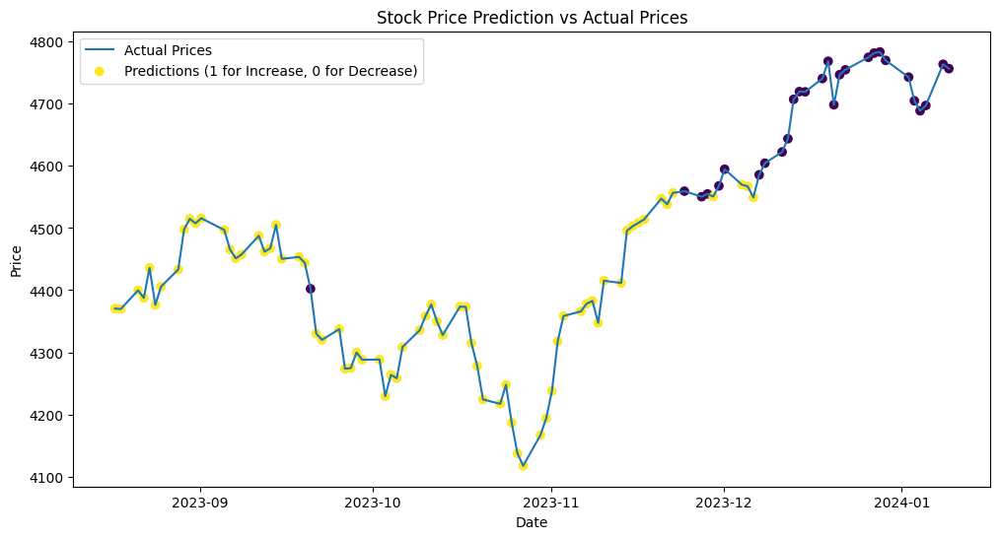

# Advanced Machine Learning Techniques for Stock Price Prediction

[Code Repository](https://github.com/JoseAndresBaca/joseandresbaca.github.io/blob/master/Portfolio/ML%20Techniques%20for%20Stock%20Price%20Forecasting/ml_techniques_for_stock_price_forecasting.py)

## Project Description
This initiative undertakes the complex task of forecasting stock price movements through the application of advanced machine learning models. By leveraging historical stock data complemented by a suite of technical indicators, the project aims to construct a predictive model capable of anticipating the direction of stock price changes with a focus on accuracy and precision.

## Objectives and Goals
- To meticulously preprocess and transform historical stock data into a structured format conducive to machine learning applications.
- To engineer a comprehensive set of features from technical indicators that encapsulate potential predictive signals.
- To employ the RandomForestClassifier, an ensemble machine learning method, to uncover patterns and trends in stock market data.
- To evaluate the model's performance using precision score and other relevant metrics to ensure reliable predictions, especially for identifying price increases.

## Data Used
### Sources
- The dataset is sourced from Yahoo Finance, providing a rich history of stock prices and trading volumes.
- A broad spectrum of technical indicators, calculated from the stock price history, forms the feature set for the predictive model.

### Data Description
The curated dataset integrates a wide array of technical indicators, including but not limited to:
- Moving Averages (50-day and 200-day)
- Relative Strength Index (RSI)
- Moving Average Convergence Divergence (MACD)
- Bollinger Bands
- Money Flow Index (MFI)
- Fibonacci Retracement Levels

The target variable is a binary classification of whether the stock price will increase (1) or decrease (0) on the following trading day.

## Analysis and Methodology

### Python Packages for Complex Data Analysis
The project utilizes a select group of Python packages, each providing advanced capabilities crucial to the project's data processing and analysis needs:
- **Scikit-learn**: For implementing sophisticated machine learning algorithms and facilitating model evaluation.
- **Matplotlib**: For generating comprehensive visualizations to illustrate the predictive performance of the model.
- **yfinance**: For accessing and retrieving detailed historical stock market data, which serves as the backbone for our analysis.

These specialized tools form the bedrock of our analysis, enabling complex operations ranging from data acquisition and preprocessing to model development and evaluation.

### Feature Combination Analysis
An exhaustive search was conducted to ascertain the most predictive combination of technical indicators. The RandomForestClassifier was trained on various subsets of features, with the model's precision score serving as the primary metric for success. The table below encapsulates the precision scores of the top-performing feature combinations:

| Feature Combination                                 | Precision Score |
|-----------------------------------------------------|-----------------|
| Close, 200_MA, MACD, BB_Upper                       | 0.5579          |
| Close, 50_MA, 200_MA, Fib_Level1                    | 0.5571          |
| Close, 50_MA, 200_MA, Fib_Level2                    | 0.5571          |
| Close, 50_MA, 200_MA, Fib_Level3                    | 0.5571          |
| Close, 50_MA, 200_MA, MACD_Signal, BB_Lower         | 0.5565          |
| 50_MA, MACD, BB_Upper, Fib_Level1                   | 0.5551          |
| 50_MA, MACD, BB_Upper, Fib_Level2                   | 0.5551          |
| 50_MA, MACD, BB_Upper, Fib_Level3                   | 0.5551          |
| 200_MA, MACD, BB_Upper, BB_Lower                    | 0.5547          |
| Close, 200_MA, MACD_Signal, BB_Lower                | 0.5541          |

This meticulous analysis has highlighted the intricacies inherent in predicting stock prices and the subtle yet profound impact that the correct blend of technical indicators can have on the precision of a predictive model.

## Results
The project's findings offer a nuanced perspective on the predictability of stock prices. A detailed comparison of the model's predictions against the actual stock prices reveals the conditions under which the model excels and where it falters.

*Figure: This plot contrasts the model's predicted stock price movements with actual prices, providing a visual assessment of the model's accuracy.*

The model demonstrates promising precision in certain market conditions, particularly when leveraging indicators that encapsulate market momentum and volatility. However, the complexity of market dynamics and the influence of external factors not captured within the model's scope underscore the challenges faced in the realm of stock price prediction.

## Conclusions

The foray into the predictive modeling of stock prices has been a testament to the potential and limitations of applying machine learning in the financial domain. The RandomForestClassifier, armed with a diverse array of technical indicators, has provided a lens through which we can glimpse the often opaque mechanisms driving stock market behavior.

The precision scores achieved by our model, particularly with certain feature combinations, suggest that there is merit in the pursuit of technical analysis as a predictive tool. Features that encapsulate long-term trends (200_MA), momentum (MACD), and volatility (Bollinger Bands) have shown promise in aligning with subsequent price movements. However, the nuanced nature of stock price fluctuations, dictated by a confluence of global events, investor sentiment, and market speculation, presents a complex puzzle that no single model can solve in isolation.
